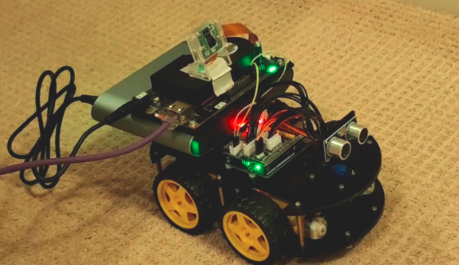
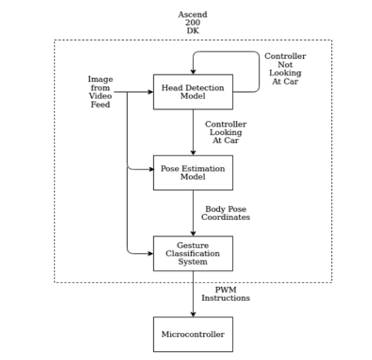
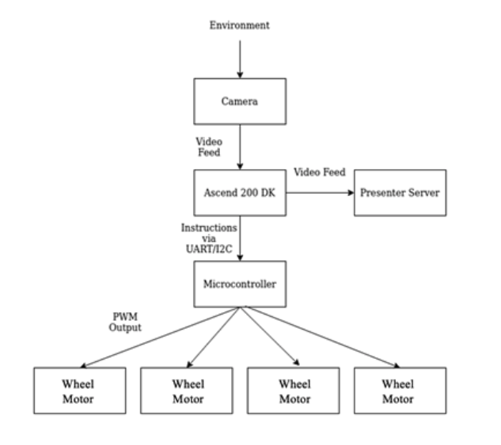
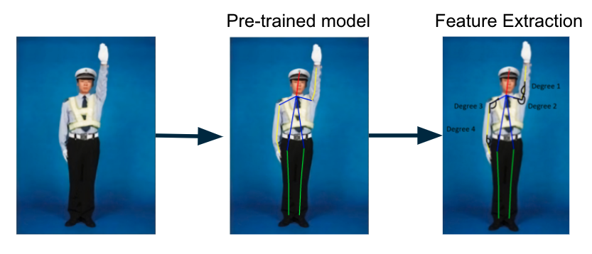

# Automated Traffic Police Signal Recognition System 

## Capstone Team Information
The Automated Traffic Police Signal Recognition System is Team 30's project sponsored by Huawei Technologies.



### Team Members
- Vincent Chua
- Tiancheng Feng
- Kelvin Koon
- Richard Wang
- Hongrong Zhang


## Project Overview

This application runs on the Atlas 200 DK Board, which runs Ubuntu Linux. This project demonstrates the ability to control an RC Car by performing gestures in front of the car. The Atlas 200 DK board runs the machine learning models and detects the specific gesture based on reference images (see reference_poses directory for the reference images). In total, the application can detect stop, turn left, and turn right instruction. 

The Atlas board communicates with an Arduino using UART communication, and after receiving an instruction, the Arduino controls the motors of the RC Car accordingly. 

The capstone video demonstration can be found [here](https://www.youtube.com/watch?v=mW9Bn993z3k).


## Directory Overview
```
├── atlas_utils             # Atlas utils module
├── model                   # Store models and offline models here
├── presenterserver         # Presenter Server module
├── reference_pose          # Reference poses for classification
├── scripts                 # run_presenter_server.sh script
└── src                     # Main program
    └── sketch_rccar        # Arduino program file 
    └── main.py             # State Machine and Model Execution
    └── pose_decode.py      # Decoding body pose
    └── uart.py             # 200DK Uart API
```

## Software Architecture
### State Machines
The software state machine uses the head pose and body pose estimation models to determine how the car should move. The models are used in sequence to achieve the desired result.



The hardware state machine processes the flow of data from the camera to the motors driving the car.



### Gesture Classifier
The gesture classification extracts the angles between the output segments to determine which gesture was provided.



## Setup Configuration

The overall sequence to start the application is:
- Hardware Setup
- Models Setup
- Flash src/sketch_rccar/sketch_rccar.ino to the Arduino on the ELEGOO RC Car
- Environment Setup on Atlas board
- Presenter Server Setup
- Run Application
- Begin performing gesture in front of RC Car

## Hardware Setup
- [Huawei Atlas 200 DK board, type IT21DMDA (Linux Ubuntu system)](https://e.huawei.com/en/products/cloud-computing-dc/atlas/atlas-200)
- [Raspberry Pi Camera](https://www.raspberrypi.org/products/camera-module-v2/)
- [ELEGOO Smart Robot Car Kit V3.0 (contains Arduino Uno R3)](https://www.elegoo.com/products/elegoo-smart-robot-car-kit-v-3-0-plus)
- Power supply (12V,3A). [Recommended powerbank](https://www.amazon.ca/Krisdonia-25000mAh-Portable-External-Macbooks/dp/B076GYGR6M/ref=sr_1_7?dchild=1&keywords=laptop%2Bpower%2Bbank&qid=1615936374&sr=8-7&th=1).
- Ethernet cable for Internet connection
- Jumper wires 


1. Power the Atlas 200 DK board and attach the ethernet cable to provide Internet connection.
2. Attach the Raspberry Pi Camera to the board. See this [link](https://support.huaweicloud.com/intl/en-us/qs-atlas200dkappc32/atlased_04_0006.html) for instructions on attaching.
3. Set up the ELEGOO Smart Car according to its instruction manual. 
4. A UART connection is required to send messages from the Atlas board to the Arduino. This connection is unidirectional. 
- Connect Atlas board Tx (pin 16) to Arduino Rx. This sets up the connection to send from Atlas to Arduino.
- Connect Atlas GND to Arduino GND. 

## Models Setup
This project uses three models
- Body Pose Estimation (included in repo)
- Face Detection 
- Head Pose Estimation


In order to run this project, the Face Detection and Head Pose Estimation models need to be downloaded and converted to offline model (*.om) format to use. Please follow the instructions in models/README.md and place the *.om files in the models/ directory. 


Huawei's Ascend platform is open-source. As such, these Github repositories were used as examples to follow:
- [Huawei's Head Pose Estimation model](https://github.com/Atlas200dk/sample-headposeestimation)
- [Huawei's Body Pose Estimation model](https://github.com/Atlas200dk/sample_bodypose)

## Prepare Environment
### Libraries 
To install the Python 3 operating environment required, please follow Huawei's [guide](https://github.com/Huawei-Ascend/samples/blob/master/python/environment/python_ENV/README_200DK_EN.md) for the Ascend 200 DK. The dependencies needed are as follows:
```
OpenCV-Python3
FFmpeg
Cython
numpy
pillow (5.1.0)
libtiff5-dev
libjpeg8-dev
zlib1g-dev
libfreetype6-dev
liblcms2-dev
libwebp-dev
tcl8.6-dev
tk8.6-dev
python-tk
pyserial
tornado 
protobuf 
```

**Note,** The following setup is for the scenario where you have a Ubuntu server/PC and Atlas 200 DK setup as [official guide](https://support.huaweicloud.com/intl/en-us/productdesc-A200dk_3000/atlas200_DK_pdes_19_0007.html), and Atlas 200 DK is connected directly with the server/PC with USB or network cable. 

On the server/PC, clone or download the project repository.

### Programming Language
The entirety of the project was written using Python3 for the Ascend board and ArduinoC for the Arduino microcontroller. Python and C++ are both compatible with the Ascend platform. The simpler syntax of Python was preferred to allow for faster prototyping. Furthermore, the example code in the open-source repository was mostly in Python, which made it easier to follow. The Arduino microcontroller is built off of Arduino C, making it the best choice. All code written by our team is located in the `src` folder. 
- State Machine: Dictated what the RC car should do at each step of the intersection
- Deep Learning Models: Allowed interfacing with the deep learning models using the Ascend board's API
- Serial Communication: Established communication between the Ascend board and Arduino micronctonroller
- Motor Control: Facilitated using pre-built Arduino library to move the car

## Environment Preparation<a name="zh-cn_topic_0228757083_section17595135641"></a> 
Make sure required libraries for Python3 environment (OpenCV, Numpy, PresentAgent and other dependencies) have been installed on Atlas 200 DK.
You may first run the application, if there is any error about missing dependency, please refer to https://github.com/Huawei-Ascend/samples/tree/master/common and install.

The operating system used for development on the Atlas 200 DK is Ubuntu 18.04. By SSH'ing into the board, one can simply edit using an editor such as Vim. Alternatively, you can use Visual Studio Code to do a remote login with the board, which will handle the SSH connection for you.

## Presenter Server Setup

1.  Go to the project directory.

2.  Modify the configuration file, if you need to view the detection results using presenter server for the live input or video source.  

    Modify **presenter\_server\_ip** and **presenter\_view\_ip** in **body\_pose.conf** to the current ubuntu server and atlas200dk development board network port ip,           **presenter \_agent\_ip** is the ip of the network port connected to the ubuntu server on the development board.

    If you use USB connection, the USB network port ip of the development board is 192.168.1.2, and the network port ip of the virtual network card connected to the ubuntu server and the development board is 192.168.1.223, then the configuration file content is as follows:

    **presenter\_server\_ip=192.168.1.223**

    **presenter\_view\_ip=192.168.1.223**

    **presenter\_agent\_ip=192.168.1.2**
    
    Generally, when connecting via USB, atlas200dk\_board\_ip is the USB network port ip of the development board, and the default is 192.168.1.2. When connecting through a network port, atlas200dk\_board\_ip is the network port ip of the development board, and the default is 192.168.0.2.

3.  Copy the application code to Atlas 200 DK board.
   
    Navigate to the directory where the sample_bodypose application code is located, such as: AscendProjects/sample_bodypose, execute the following command to copy the application code to the development board. If the copy fails, please check if there is a directory HIAI\_PROJECTS on the development board, and if not, create it.

    ```
    scp -r ~/AscendProjects/<project-name> HwHiAiUser@192.168.1.2:/home/HwHiAiUser/HIAI\_PROJECTS
    ```

    Enter the development board password when prompted for password. The default password of the development board is `Mind@123`

    
4.  Start Presenter Server, if you need to view the detection results using presenter server for the live input or video source, otherwise, skip this step.

    Execute the following command to start the Presenter Server in the background.

    **bash $HOME/AscendProjects/sample_bodypose/script/run_presenter_server.sh &**

    Log in to the Presenter Server using the prompted URL. The figure below shows that the Presenter Server has started successfully.

    **Figure**  Home Page Display<a name="zh-cn_topic_0228757088_fig64391558352"></a>  


    
    The communication between Presenter Server, Mind Studio and Atlas 200 DK is shown as below：


    **Figure**  Examples of IP addresses<a name="zh-cn_topic_0228757088_fig1881532172010"></a>  


    NOTE:

    -   The IP address used by the Atlas 200 DK developer board is 192.168.1.2 (USB connection).
    -   The IP address for the communication between Presenter Server and Atlas 200 DK is the IP address of the UI Host server on the same network segment as Atlas 200 DK, for example: 192.168.1.223.
    -   This example of the IP address for accessing Presenter Server through a browser is 10.10.0.1. Since Presenter Server and Mind Studio are deployed on the same server, this IP address is also the IP for accessing Mind Studio through a browser.

    
5.  Copy acl.so to the development board. Please skip this step if the file already availabe on Atlas 200 DK directory **/home/HwHiAiUser/Ascend/**.

    **scp ~/Ascend/ascend-toolkit/20.0.RC1/arm64-linux_gcc7.3.0/pyACL/python/site-packages/acl/acl.so HwHiAiUser@192.168.1.2:/home/HwHiAiUser/Ascend/**  

    **Please replace X.X.X with the actual version number of the Ascend-Toolkit development kit package**   
    **For example: the package name of the Toolkit package is Ascend-Toolkit-20.0.RC1-x86_64-linux_gcc7.3.0.run, then the version number of this Toolkit is 20.0.RC1.**


6. Log in to the development board and add environment variables. Please skip this step if it is already done in other projects.

    **ssh HwHiAiUser@192.168.1.2**  
    **vim ~/.bashrc**   
    Add two lines at the end    
    **export LD_LIBRARY_PATH=/home/HwHiAiUser/Ascend/acllib/lib64**   
    **export PYTHONPATH=/home/HwHiAiUser/Ascend/:\\${PYTHONPATH}**  
       

    Execute the following command to make the environment variable take effect
    
    **source ~/.bashrc**  


## Run Application

1. Make sure the presenter server is running on the server side. In the project main directory run the following:
    ```
    bash run_presenter_server.sh &
    ```


2. On the development board, navigate to the code directory and run:
    ```
    python3 main.py
    ```
    
    **Note**, for the live camera case, the "CAMERA0" camera is used by default. Please refer to the link below for the viewing method.   
   https://support.huaweicloud.com/usermanual-A200dk_3000/atlas200dk_02_0051.html 
   

3.  Go to the Presenter Server website using the URL that was prompted when the Presenter Server service was started. 

    Wait for the Presenter Agent to transmit data to the server, and click "Refresh" to refresh. When there is data, the status of the corresponding Channel turns green, as shown in the figure below.

    **Figure**  Presenter Server<a name="zh-cn_topic_0228461904_zh-cn_topic_0203223294_fig113691556202312"></a>  
 

    Click the corresponding View Name link on the right, such as "video" in the above picture, to view the results.

## Stopping Application<a name="zh-cn_topic_0228757088_section1092612277429"></a>

If the presenter server is being used for display, stop 

-   **Stop Presenter Server**

    The Presenter Server service will always be running after it is started. If you want to stop the Presenter Server service corresponding to the pose detection application, you can perform the following operations.

    Execute the following command on the command line on the server where the process of the Presenter Server service is running:
    
    **ps -ef | grep presenter**

    ```
    ascend@ubuntu:~/AscendProjects/sample_bodypose/script$ ps -ef | grep presenter
    ascend 9560 1342 0 02:19 pts/4  00:00:04   python3/home/ascend/AscendProjects/sample_bodypose.bak/script/..//present
    erserver/presenter_server.py --app sample_bodypose
    ```

    As shown above, _9650_ is the process ID of the Presenter Server service corresponding to the sample_bodypose application.

    If you want to stop this service, execute the following command:


    **kill -9** _9650_

## Known Bugs and Issues
Due to the time-constrained nature of the course and COVID-19 restrictions, the team was unable to properly address the following fully. These are the known bugs and issues as of submission and recommended fixes.
- Gesture classification state machine does not loop (fixed by adding a restart condition to the state machine)
- Stopping in front of an obstacle (fixed by implementing sonar sensor obstacle detection (code included in ELEGOO sample code))
- RC car driving issues due to weight (requires a platform on the RC car to hold the additional power bank and board components)

## Future Work
The following are additional features which may be added for future work done on the project
- Custom trained models for better gesture classification
- Additional sensors for improved intersection navigation
